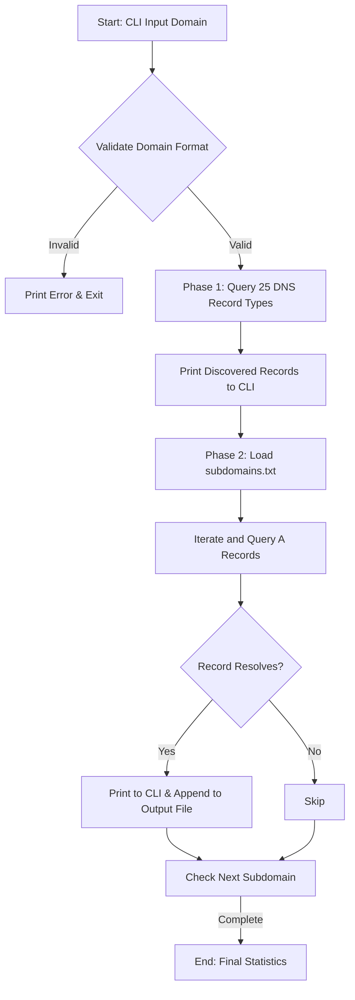

# DNScan: Simple DNS Tooling

A lightweight, modular, and educational command-line tool designed for DNS record enumeration and subdomain discovery. Built using Python, this utility serves as an introductory instrument for security auditing, network administration, and educational demonstrations of DNS architecture.

## Features

*   **Comprehensive Record Enumeration:** Iterates through and queries 25 distinct DNS record types (including `A`, `AAAA`, `MX`, `NS`, `TXT`, `SOA`, `CNAME`, `SRV`, and more) using the system's configured DNS resolver.
*   **Wordlist-Based Subdomain Discovery:** Performs dictionary-based subdomain queries to identify active hostnames within a target domain.
*   **Result Exportation:** Automatically exports validated subdomains to a dedicated output file (`<domain>_valid_subdomains.txt`) for downstream processing.
*   **Enhanced CLI Interface:** Utilizes structured animations and colored terminal logs via `colorama` and `pyfiglet` to organize visual output.
*   **Graceful Interrupt Handling:** Captures `Ctrl+C` inputs to exit scans cleanly without raising unhandled traceback exceptions.

---

## Use Cases

*   **Attack Surface Management & Reconnaissance:** Helps security professionals map out active subdomains and public-facing assets during authorized network assessments.
*   **Configuration Audits:** Enables system administrators to verify that public DNS zone records (such as SPF/TXT records or MX records) are correctly populated and up-to-date.
*   **Educational Environments:** Demonstrates the core concepts of DNS zone resolution, record relationships, and wordlist-based enumeration in security training labs.

---

## Tech Stack

*   **Language:** Python 3
*   **Libraries:** 
    *   `dnspython` (for programmatic DNS queries and resolver management)
    *   `colorama` (for cross-platform terminal text colorization)
    *   `pyfiglet` (for ASCII art title generation)
*   **Protocols involved:** Domain Name System (DNS) over UDP/TCP (Port 53)

---

## Project Architecture

The application executes linearly in two primary phases:



### Data Flow & Logic
1.  **Validation:** Input domain strings are evaluated using a strict regular expression validation helper before any network traffic is generated.
2.  **DNS Enumeration Phase:** The resolver sequentially queries the target domain against a predefined list of 25 record types. Any query resulting in a successful response is logged; `NoAnswer` or timeout exceptions are silently ignored.
3.  **Subdomain Discovery Phase:** The script opens the local `subdomains.txt` wordlist, reads entries sequentially, constructs the fully qualified domain name (FQDN), and performs an `A` record resolution. Discovered subdomains are written directly to `<domain>_valid_subdomains.txt` in real time.

---

## Installation

### Prerequisites
*   Python 3.7 or higher installed on your system.

### Steps
1.  Clone the repository:
    ```bash
    git clone https://github.com/Trident09/Simple-DNS-tooling.git
    cd Simple-DNS-tooling
    ```

2.  Create and activate a virtual environment:
    *   **Linux/macOS:**
        ```bash
        python3 -m venv venv
        source venv/bin/activate
        ```
    *   **Windows:**
        ```bash
        python -m venv venv
        venv\Scripts\activate
        ```

3.  Install the required dependencies:
    ```bash
    pip install -r requirements.txt
    ```

---

## Usage

Ensure that you have a wordlist file named `subdomains.txt` in the root directory of the project.

### Command Syntax
```bash
python3 dns_enum.py <target-domain>
```

### Arguments
*   `<target-domain>`: The domain name to inspect (e.g., `example.com`).

---

## Example Workflow

1.  **Populate the Wordlist:** Place your target subdomains in the `subdomains.txt` file:
    ```text
    www
    mail
    dev
    api
    staging
    ```
2.  **Execute the Tool:** Run the script targeting your destination domain:
    ```bash
    python3 dns_enum.py example.com
    ```
3.  **Review the Output:** Inspect the generated terminal logs and check the newly created output file containing valid records:
    ```bash
    cat example.com_valid_subdomains.txt
    ```

---

## Example Output

```text
______  _   _  _____                     
|  _  \| \ | |/  ___|                    
| | | ||  \| |\ `--.  ___  __ _  _ __  
| | | || . ` | `--. \/ __|/ _` || '_ \ 
| |/ / | |\  |/\__/ / (__| (_| || | | |
|___/  \_| \_/\____/ \___|\__,_||_| |_|
                                       
[+] DNS Enumeration started for : example.com

--------------------------------------------------
[+] example.com - A - 93.184.215.14
--------------------------------------------------
[+] example.com - MX - 0 mail.example.com.
--------------------------------------------------
[+] example.com - NS - ns1.example.com.
--------------------------------------------------
[+] example.com - TXT - "v=spf1 -all"

[+] DNS Enumeration completed


[+] Initiating subdomain scan for: example.com 

www.example.com is valid
mail.example.com is valid
```

---

## Detection / OPSEC Notes

*   **Noisy Scanning:** Subdomain discovery uses sequential, synchronous DNS resolution queries. Security monitoring solutions, such as local Intrusion Detection Systems (IDS) or centralized SIEM platforms, can detect high-frequency DNS query patterns pointing to non-existent domains (`NXDOMAIN` responses).
*   **Resolver Caching:** The tool relies on default system DNS resolvers. In large environments, query spikes might trigger rate limiting or temporary blocking at the upstream recursive resolver level.
*   **Stealth Limitations:** This implementation does not feature random delays between queries or custom user-agent routing for DNS requests, making it easily distinguishable from standard user web browsing traffic.

---

## Limitations

*   **Synchronous Execution:** Queries are processed one line at a time, which may result in longer scan times when working with large wordlists.
*   **System Resolver Dependency:** The script uses the DNS configurations defined by your local operating system rather than allowing external resolver rotation (e.g., querying public nameservers directly).
*   **Wildcard Handling:** The current version does not pre-evaluate wildcard DNS configurations. If the target domain has a wildcard `A` record configuration, the script will report all subdomains in the list as valid.

---

## Future Improvements

*   **Asynchronous Support:** Integrate Python’s `asyncio` or concurrent threading pool to perform multi-threaded resolution.
*   **Wildcard Detection:** Implement pre-scan validation to detect wildcard DNS records and prevent false-positive reporting.
*   **Custom Resolvers:** Add support for a `--resolvers` command-line argument to allow users to load custom nameservers.
*   **Flexible Output Formats:** Include flags for exporting findings in standardized formats such as JSON or CSV.

---

## Learning Objectives

By reading and reviewing the codebase of this project, you can learn:
1.  **DNS Library Integration:** How to use the `dnspython` API to interact directly with DNS query mechanisms.
2.  **Error & Exception Handling:** Managing networking-related exceptions like `NXDOMAIN` (domain does not exist) and `NoAnswer` cleanly in Python.
3.  **Command-Line Interface Development:** Structuring user interfaces with visual progress feedback, exit signals, and formatted logs.

---

## Disclaimer

This project is created for authorized security assessments, network administration diagnostics, and educational research purposes only. Do not run this tool against target domains without prior written authorization from the system owners. The developers accept no liability and are not responsible for any misuse, damage, or legal infractions caused by this application.
