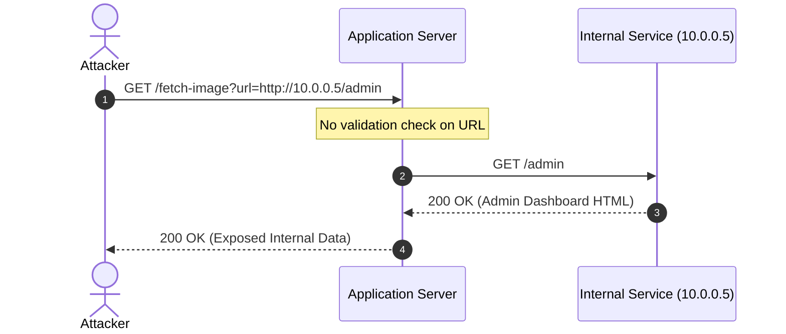
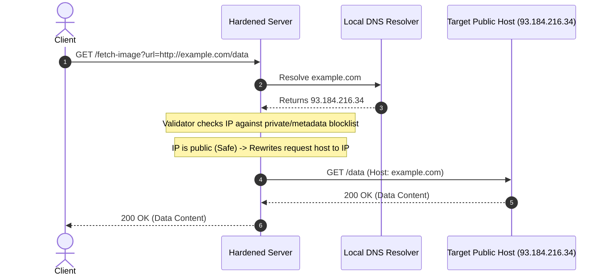

# Server-Side Request Forgery (SSRF)

## 1. Executive Summary
This project is an educational and secure design demonstration platform designed to illustrate how Server-Side Request Forgery (SSRF) vulnerabilities occur and how to mitigate them using defense-in-depth methodologies.

Web applications often retrieve external resources (such as loading remote images, checking status feeds, or executing webhook callbacks). When these requests are made to user-supplied URLs without proper validation, SSRF occurs. The server acts as a proxy, executing requests on behalf of the attacker, which can lead to:
*   Bypassing firewalls to scan internal networks.
*   Accessing loopback services (`127.0.0.1`).
*   Leaking sensitive cloud instance credentials from local metadata services (e.g. AWS IMDS, GCP metadata).
*   Abusing trust relationships to interact with internal APIs.

This repository implements two functional FastAPI demonstration servers—one vulnerable, one hardened—alongside a robust URL validation library and an egress mitigation HTTP transport to teach secure application design and detection engineering.

---

## 2. Research & Educational Objectives
*   **Vulnerability Mechanics:** Demonstrate how unvalidated URL inputs are resolved and fetched by HTTP libraries.
*   **Risk Vector Demonstration:** Illustrate specific dangers related to AWS/GCP link-local metadata endpoints (`169.254.169.254`) and internal subnets.
*   **Anti-Bypass Defenses:** Teach how to handle DNS Rebinding attacks—a common bypass technique where DNS records change between validation (Time-of-Check) and connection (Time-of-Use).
*   **Log Telemetry & Detection:** Design detailed log formats to identify outbound scanning from server logs.

---

## 3. System Architecture & Request Flows

### Vulnerable Request Flow
The application receives a URL from the user, immediately invokes the HTTP client, and resolves/connects to the target. This exposes private systems directly.



### Hardened Request Flow
The application receives the URL, runs it through the validation library, resolves the hostname to check resolved IPs against restricted ranges, rewrites the request destination to the validated IP to prevent DNS rebinding, and makes a safe connection.



---

## 4. Threat Model (STRIDE)

| Threat Category | Specific SSRF Threat | Mitigation Strategy |
| :--- | :--- | :--- |
| **Information Disclosure** | Reading responses from internal databases or cloud metadata services. | Block internal/private IP ranges. Implement egress firewalls on the server instance. |
| **Tampering** | Sending POST requests to internal administrative interfaces to alter application state. | Validate all schemes, ports, and IP addresses. Disable HTTP redirects or re-validate redirect locations. |
| **Repudiation** | Attacking third-party systems using the application server as a launchpad, masking the attacker's true IP. | Log all outgoing requests and associate them with the initiating user session ID. |
| **Denial of Service** | Forcing the server to request huge files or connect to slow, hanging hosts (Tarpits), consuming all threads. | Set strict connection and read timeouts on outbound HTTP clients. |

---

## 5. Vulnerable vs. Secure Design Comparison

| Security Control | Vulnerable Design | Hardened Design |
| :--- | :--- | :--- |
| **Scheme Enforcement** | Accepts any scheme (`gopher://`, `file://`, `ftp://`). | Restricts to `http` and `https` only. |
| **Port Filtering** | Connects to any port (`22`, `3306`, `11211`). | Enforces ports `80` and `443` only. |
| **DNS Resolution** | Relies on the HTTP library resolving the target host dynamically. | Pre-resolves hostname and validates all resolved IP addresses. |
| **DNS Rebinding Protection** | Absent (subject to TOCTOU attacks). | Enforces IP pinning at the transport level. |
| **Error Handling** | Prints full connection tracebacks and socket exceptions to the client. | Suppresses system exceptions; returns generic errors to clients while logging details locally. |

---

## 6. Directory Structure
```
ssrf-scanne/
├── app/
│   ├── __init__.py
│   ├── middleware.py        # Outbound HTTP validation transport wrappers
│   ├── secure_app.py        # Hardened FastAPI application
│   └── vulnerable_app.py    # Unsecured FastAPI application
├── docs/
│   ├── detection_guide.md   # SIEM rules, logs, and monitoring strategies
│   └── incident_response.md # Playbook for responding to SSRF events
├── lib/
│   ├── __init__.py
│   └── validator.py         # Subnet & URL validation logic
├── tests/
│   └── test_validation.py   # Pytest suite verifying validation logic
├── README.md
└── requirements.txt
```

---

## 7. Lab Setup & Verification

### Running the Apps Locally
To demonstrate the contrast in security design, run both apps:

1. Install dependencies:
   ```bash
   pip install -r requirements.txt
   ```

2. Run the vulnerable application:
   ```bash
   uvicorn app.vulnerable_app:app --host 127.0.0.1 --port 8000
   ```

3. Run the secure application:
   ```bash
   uvicorn app.secure_app:app --host 127.0.0.1 --port 8001
   ```

4. Execute test validation suite:
   ```bash
   pytest tests/
   ```
